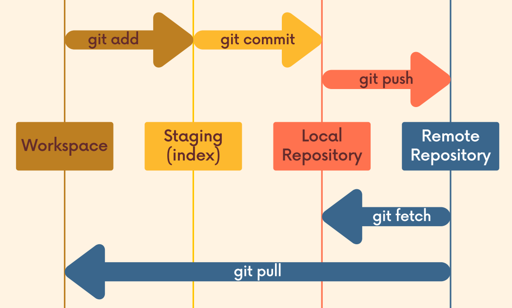

See the Git documentation for more info: 

[Git - Documentation](https://git-scm.com/doc)

**What Is Git?**

💡  Git is a **version control system** that helps users **track changes** in their files, collaborate efficiently, and revert to previous versions if needed. It also ensures that multiple people can work on the same project without conflicts.

## Repositories
    
### What’s a repository?

A repository (repo) is a storage location where all the files, history, and version tracking information for a project are kept.

#### Git has 2 repositories types:

1. **Local repository** - Stored on your own machine.
2. **Remote repository** - Hosted in a git server.

#### Local Repository - Consists of 3 stages

**1. Working stage**
- This is where you **create, edit, and modify files**.
- Files in this area are **not yet tracked** by Git or have been modified after the last commit.

**2. Staging stage**
- Acts as **the middle step** between the working area and the local repository.
- Allows to **prepare and review** changes **before** officially saving them in a **commit**.

**3. Commited Files**
- Where **committed changes** are stored permanently.
- Every commit acts as a **snapshot** of the project at a specific time.
    
